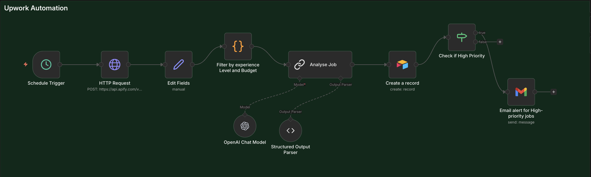

# Upwork Job Scraper & AI Scorer (n8n Automation)

This repository contains an advanced n8n workflow that automates the process of finding, filtering, and scoring Upwork jobs using AI.

## 📂 Project Files

### 1. **[Updated n8n Workflow](Updated%20Upwork%20Automation.json)**

The complete JSON file for the automation workflow.

- **Features**:
  - Scrapes jobs via Apify.
  - Filters out low-quality/irrelevant jobs via Code Node.
  - Scores jobs (1-10) using OpenAI (GPT-5 Mini) based on custom criteria.
  - Saves results to Airtable.
  - Sends Gmail alerts for high-priority leads.

### 2. **[Setup Documentation](SETUP.md)**

Step-by-step guide on how to:

- Import the workflow into n8n.
- Configure Apify, OpenAI, Airtable, and Gmail credentials.
- Run the automation locally or on a server.

### 3. **[Configuration Template](config_template.json)**

A JSON template listing all the environment variables and credentials required. **No secrets are exposed** in this repository.

### 4. **[Improvement Report](report.md)**

A detailed 1-page report covering:

- **Issues Identified & Fixed**: Security fixes (token redaction) and logic enhancements.
- **Sample Scored Jobs**: 5 real-world examples showing how the AI scores and prioritizes jobs.
- **Future Improvements**: Suggestions for error handling and optimization.

---

## 🎥 Demo Video

> **Watch the full workflow execution, AI scoring, and Airtable population here:**
>
> [https://drive.google.com/file/d/1_NZ7cCvXoxjb_PKLoVo8bcO8D5znpjtU/view?usp=sharing]

---

## 🚀 Quick Start

1.  Clone this repo.
2.  Import `Updated Upwork Automation.json` into n8n.
3.  Follow the [Setup Guide](SETUP.md) to add your keys.
4.  Activate the workflow!
